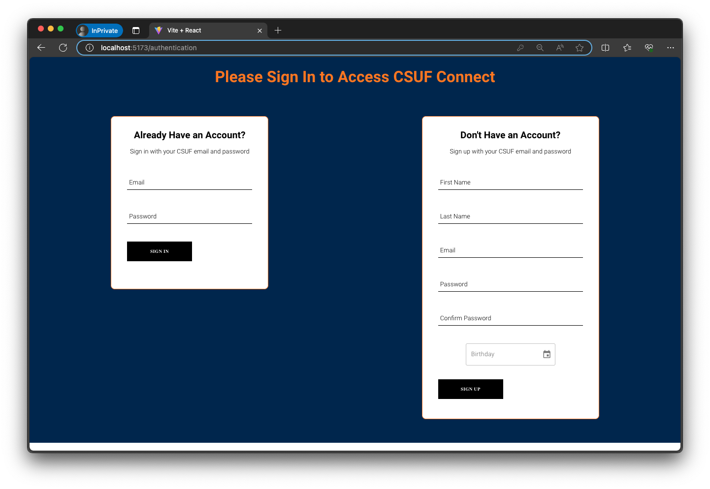
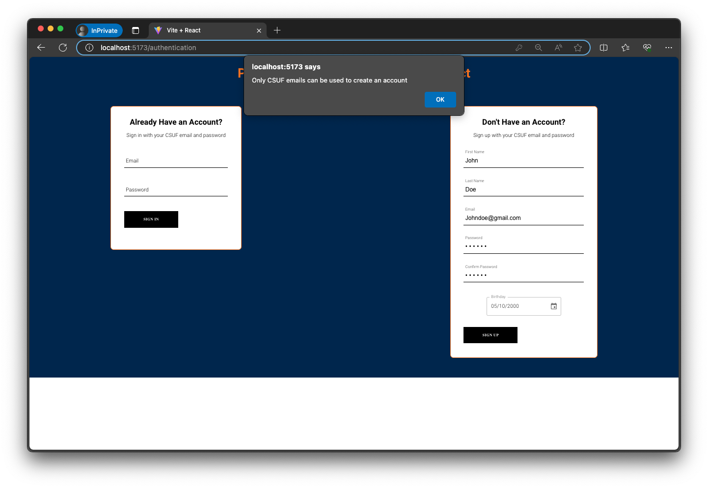
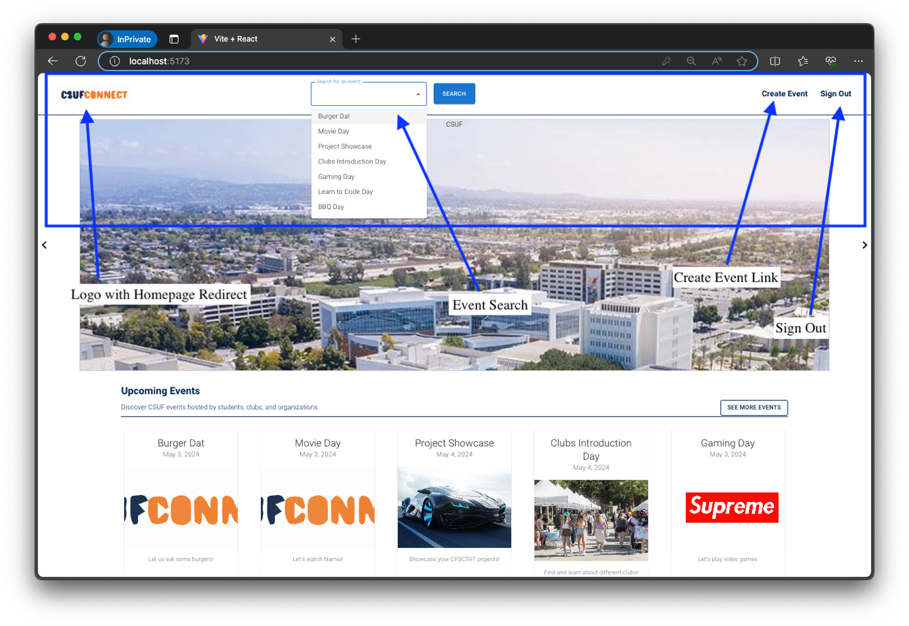
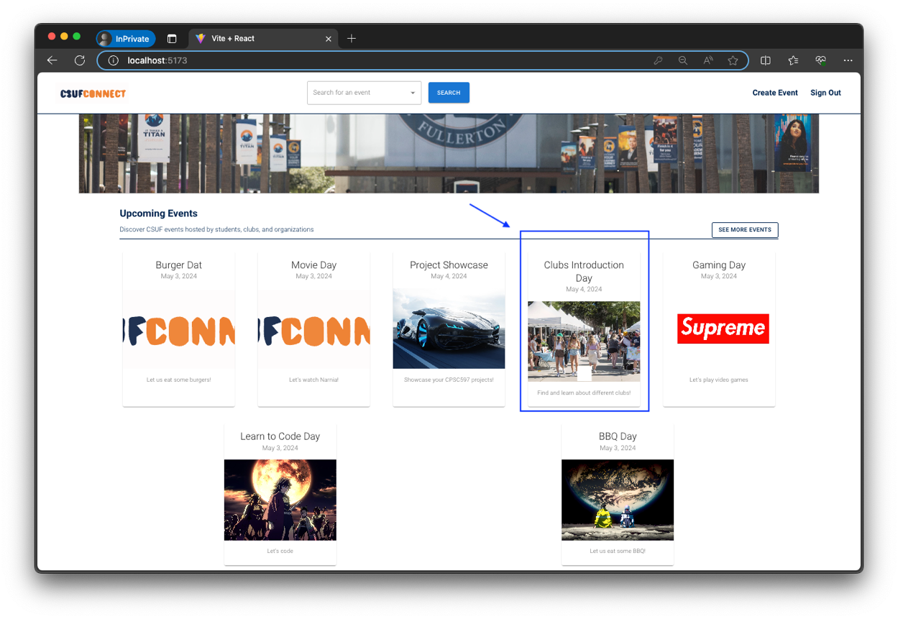
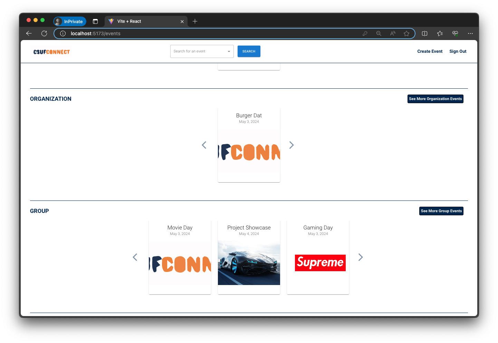
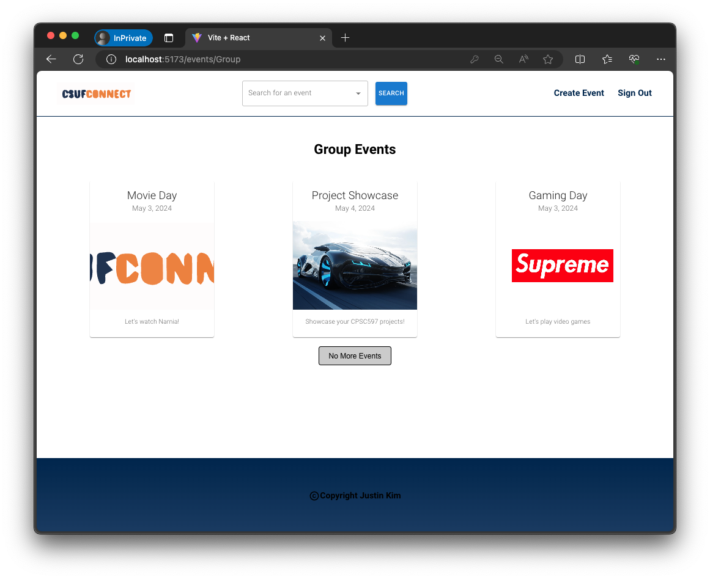
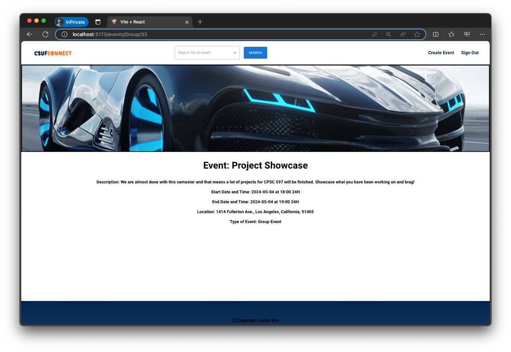
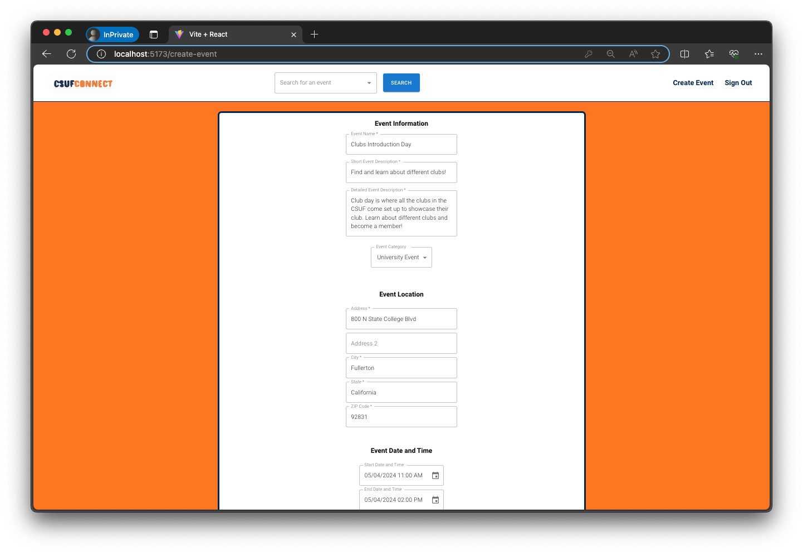

# CSUFConnect Frontend
## Developer: Justin Kim

This is the frontend application for **CSUFConnect**, a community-driven web platform designed to connect students at California State University, Fullerton. The app aims to facilitate collaboration, communication, and event sharing among students with a modern and user-friendly interface.

## Project Overview

**CSUFConnect** was built with the intention of strengthening the campus community. Many students struggle to find clubs, projects, or peers to collaborate with. This platform provides a space for students to:
- Discover ongoing student-led projects.
- Connect with others based on shared interests.
- Join or create posts and events.
- Share resources such as flyers and media.

---

## Tech Stack

- **Vite + React**: Frontend development and bundling.
- **Redux Toolkit**: Efficient global state management.
- **MUI (Material UI)**: For consistent and responsive UI components.
- **Firebase Authentication**: User login and account management.
- **AWS S3 Buckets**: For storing and retrieving user-uploaded images.

---

## Installation & Setup

### Prerequisites
- Node.js (v18 or later recommended)
- Yarn (used as the package manager)
- Firebase Admin SDK for backend (required if running full stack)
- Backend running at: `http://localhost:8080` (or update the environment if different)
- Backend repository and instructions: [CSUFConnect-backend-api](https://github.com/justincyk/CSUFConnect-backend-api.git)

### 1. Clone the Repository
```bash
git https://github.com/justincyk/CSUFConnect-app.git
cd CSUFConnect-app
```

### 2. Install Dependencies
```bash
yarn install
```

### 3. Create a `.env` File for Firebase Configuration
   1. Create a file named .env in the root directory of the project (same level as vite.config.js).
   2. Add your Firebase configuration keys, making sure to prefix each variable with VITE_ so that Vite can access them in the frontend:
   ```bash
    VITE_FIREBASE_API_KEY=your_api_key
    VITE_FIREBASE_AUTH_DOMAIN=your_project_id.firebaseapp.com
    VITE_FIREBASE_PROJECT_ID=your_project_id
    VITE_FIREBASE_STORAGE_BUCKET=your_project_id.appspot.com
    VITE_FIREBASE_MESSAGING_SENDER_ID=your_messaging_sender_id
    VITE_FIREBASE_APP_ID=your_app_id
   ```
   3. Do not commit this file to version control. Add .env to your .gitignore file to keep your credentials secure.

### 4. Start the Development Server
```bash
yarn dev
```
The app will start on `http://localhost:5173` by default.

### Demo
Here are some screenshots of CSUFConnect:
#### Sign-In Page

#### Creating an Account

#### Signing In

#### Sign In Error

#### Homepage

#### Upcoming Events Section

#### Events Based on Category

#### Event Category Page

#### Event Page

#### Event Form Page
